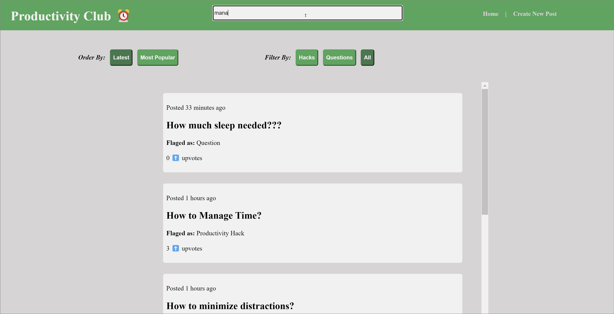

# Web Development Final Project - *Productivity Club*

Submitted by: **Harshavardan Yuvaraj**

This web app: **This web app is a productivity forum for people to share tips and tricks to gain command over their time and energy. Users can  create new posts, comment on existing ones, and ask questions too! Posts can be ordered from latest to most popular and filtered by flags such as hack, question, or all. Users can protect and ensure their right to edit or remove their original posts via a secret key set by them upon the posts' creation. **

Time spent: **10** hours spent in total

## Required Features

The following **required** functionality is completed:

- [X] **A create form that allows the user to create posts**
- [X] **Posts have a title and optionally additional textual content and/or an image added as an external image URL**
- [X] **A home feed displaying previously created posts**
- [X] **By default, the time created, title, and number of upvotes for each post is shown on the feed**
- [X] **Clicking on a post shall direct the user to a new page for the selected post**
- [X] **Users can sort posts by either their created time or upvotes count**
- [X] **Users can search for posts by title**
- [X] **A separate post page for each created post, where any additional information is shown is linked whenever a user clicks a post**
- [X] **Users can leave comments underneath a post on the post's separate page**
- [X] **Each post should have an upvote button on the post's page. Each click increases its upvotes count by one and users can upvote any number of times**
- [X] **A previously created post can be edited or deleted from its post page**

The following **optional** features are implemented:

- [X] Users can only edit and deleted posts or delete comments by entering the secret key, which is set by the user during post creation
- [ ] Upon launching the web app, the user is assigned a random user ID. It will be associated with all posts and comments that they make and displayed on them.
- [ ] Users can repost a previous post by referencing its post ID. On the post page of the new post, the referenced post is displayed and linked, creating a thread
- [ ] Users can customize the interface of the web app
- [ ] Users can share and view web videos
- [X] Users can set flags while creating a post. Then users can filter posts by flags on the home feed.
- [ ] Users can upload images directly from their local machine as an image file
- [X] Display a loading animation whenever data is being fetched

## Video Walkthrough

Here's a walkthrough of implemented user stories:

GIF created with LICEcap (https://www.cockos.com/licecap/).

## Notes

Implementing the filters for this web app was a huge challenge for me. With careful and methodically developed code, all filters, in addition to the strecth feature flags, were implemented. The secret key implementation was also tricky, but more sincere references to documentation allowed for the development of this strong feature.

## License

    Copyright [2023] [Harshavardan Yuvaraj]

    Licensed under the Apache License, Version 2.0 (the "License");
    you may not use this file except in compliance with the License.
    You may obtain a copy of the License at

        http://www.apache.org/licenses/LICENSE-2.0

    Unless required by applicable law or agreed to in writing, software
    distributed under the License is distributed on an "AS IS" BASIS,
    WITHOUT WARRANTIES OR CONDITIONS OF ANY KIND, either express or implied.
    See the License for the specific language governing permissions and
    limitations under the License.